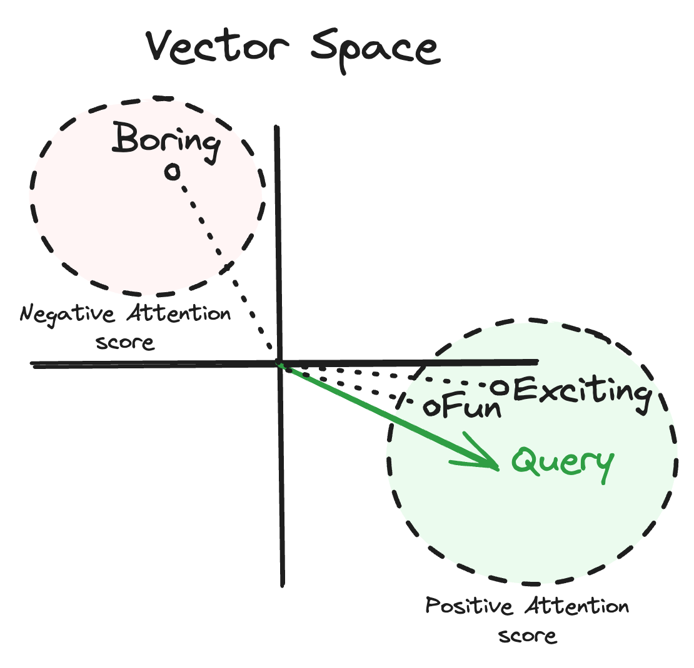
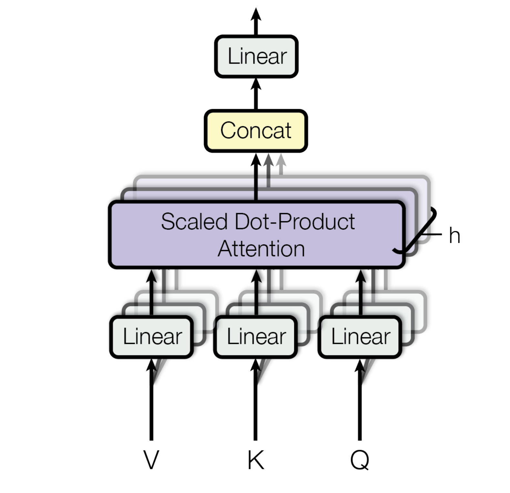
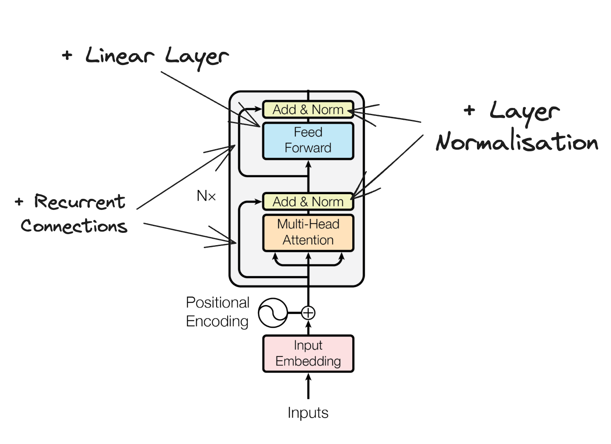
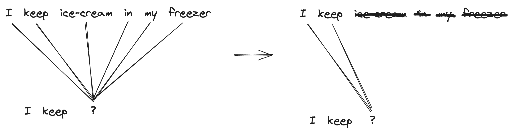

This post is an interpretation of the paper "Attention is All You Need". The purpose is to extend on [The Annotated Transformer](https://nlp.seas.harvard.edu/annotated-transformer/)
by further reordering and simplification of the paper. The motivation behind this is to increase clarity by starting with our input tensors and working through the model layer by layer rather
than starting at a point already deep in the weeds (at the encoder). Rather, we will build up to that point by starting at an input sentence, tokenizing and then creating the $Q\:K\:V$ or query, key and value matrices. Since this paper is a common starting point for those learning about the transformer architecture we try to make this post as approachable as possible and easy to understand without large amounts of prior context or knowledge.

## Tokenisation, Embedding and Linear Transformation

To get started at the very input of the transformer, let's assume a simple sentence and create an example tokenization for the sentence. Normally we would use a [tokenizer](https://platform.openai.com/tokenizer) but we will skip this for the sake of simplicity, the short explanation is that a tokenizer groups relevant neighboring characters together from a given string and converts them into a numerical representation so that they can be used as an input to a neural network. Here is our tensor, we include the batch dimension as to best reflect what happens in a built out example:
```python
sentence = ["our", "input", "sentence"]
input_tokens = torch.tensor([[0, 1, 2]]) # Batch, Sequence
```

Now we can create the embedding layer of our network. An embedding layer stores a mapping from a vocabulary of tokens to a n-dimensional vector space. In our case we use a vocabulary size of three and an embedding size of three since we are only training on this simple example. However, a typical large language model (LLM) would have a vocabulary size in the tens of thousands and embedding size in the thousands. Now if we pass our tensor to the embedding layer we will get an output of shape: Batch, Sequence, Embedding. Viewing the tensor after the embedding we can see each token in our sequence has been mapped to vector space, each being represented by an embedding of three values.

```python
vocabulary_size = 3
embedding_size = 3
embedding = torch.nn.Embedding(vocabulary_size, embedding_size)
embedded_sentence = embedding(input_tokens) # Batch, Sequence, Embedding
```
```
embedded_sentence
> tensor([[[ 0.6380, -1.4403,  0.9792],   # our
           [-1.5645,  0.0593,  0.4939],   # input
           [-0.1139, -1.0340, -0.0034]]], # sentence
            grad_fn=<EmbeddingBackward0>)
```

Given our embedded vector, we can now create our $Q\:K\:V$ matrices used in the attention mechanism mentioned in the paper. We do this by taking our embedded sentence and feeding it into three seperate fully connected layers to obtain the query, key and value matrices

```python
hidden_size = 64  
linear_transform_Q = torch.nn.Linear(embedding_size, hidden_size)
linear_transform_K = torch.nn.Linear(embedding_size, hidden_size)
linear_transform_V = torch.nn.Linear(embedding_size, hidden_size)

Q = linear_transform_Q(embedded_sentence) # batch, sequence, embedding_size
K = linear_transform_K(embedded_sentence) # """
V = linear_transform_V(embedded_sentence) # """
```

## Scaled Dot-product Attention

With our $Q\:K\:V$ matrices we will now perform the scaled dot-product attention introduced in the paper. We take the query matrix and multiply it by the transposed key matrix. Then we divide the resulting matrix by the square root length of the transformed embeddings $\sqrt{d_{k}}$, which is equal to the square-root of the linear transform's hidden size, in our case 64 -> 8. After this division step the output is optionally masked and put through a softmax function. Then dropout is applied and finally multiplied by the value matrix. The equation shown in the paper is the following (which excludes detailing the mask and dropout which we will get into, along with the purpose of the query, key and value matrices and the intuition behind them.

$Attention(Q, K, V) = softmax(\frac{QK^{T}}{\sqrt{d_{k}}})V $

And implemented as Pytorch code

```python
def attention(
      query: torch.Tensor, 
      key: torch.Tensor, 
      value: torch.Tensor, 
      mask: torch.Tensor | None = None, 
      dropout: torch.nn.Module | None = None
    ):
    query_embedding_len = query.size(-1) # same as embedding hidden size (64 in example)
    key = key.transpose(-2, -1) # batch, embedding_size, sequence
    attention_scores = query @ key / math.sqrt(query_embedding_len) # batch, sequence_length, attention_scores

    attention_scores = attention_scores.softmax(dim=-1)

    return attention_scores @ value, attention_scores
```

### Query, Key, Value

Now, we're familiar with a basic dictionary/hashmap which works to map from an exact key to a specific value

```python
d = {
   "fun": 10,
   "exciting": 9,
   "boring": -3,
 }
d["fun"] # 10
```

However, we want to do a lookup based on the meaning of the word and return a vector containing how likely it is that each key in our lookup table is likely related to our query, or rather how much *attention* we want to pay to each value based on the query. So for example, let's take the word "positive" and assume that we have a 45% match for both "fun" and "exciting" and only a 10% match for "boring".

```python
query = "rollercoaster"
0.45 * d["fun"] + 0.45 * d["exciting"] + 0.1 * d["boring"] # 5.65
```

In this example, I've created the attention scores based upon how relevant I interpret each key to the query "rollercoaster". So how does a model internally arrive at these attention scores? Now if we think back to the previous section we will be reminded that our query and key matrices have the dimensions Sequence and Embedding (plus batch as the first dimension, which we don't really need to worry about). The embedding is the crucial part here and having an understanding of how dot products work in relation to the similarity between two vectors helps. The key ideas are as follows
- If two vectors are in the same direction their dot product is at it's largest $n > 0$
- If two vectors are in the opposite direction their dot product is at it's smallest $n < 0$
- If two vectors are perpindicular their dot product will be zero $n = 0$

So when we have two *word embeddings*, our query vector's word embedding and our key vector's word embedding, and we take the dot product we get a measure of how relevant the key is in relation to the query based on how similar the two are in vector space. We've created a [desmos visualization](https://www.desmos.com/calculator/b7xvrosoyp) with two vectors and their resulting dot product to demonstrate this behaviour. This similarity is called the attention score. What's happened is that our query embedding is a vector that when mapped into the vector space of the key, is surrounded by tokens that are most relevant to pay attention to. If we change our keys into vectors where our hash-function is now similar to $query \cdot value$ we now get something that looks a bit like this:

```python
query = [8, -5]
d = {
  [5, -3]: 10, # fun 
  [6, -1]: 9,  # exciting
  [-4, 8]: 3, # boring
}
attention_scores = [8*5 + -5*-3, 8*6 + -5*-1, 8*-4 + -5*8] # [55, 53, -72]
```

As you can see if our query embedding is close within the key vector space to the "fun" and "exciting" keys it results in a high attention to these values and opposite to the "boring" key resulting in a low attention score. 



Translating our dictionary example in our pytorch code this is what is happening in the following

```python
key = key.transpose(-2, -1)
attention_scores = query @ key
```

Following this, the attention scores are then divided by the square-root of the embedding length and put through a softmax function. As the embedding length grows in size the resultant dot products can get quite large in magnitude which would make the output values from the softmax extremely close to 0 and 1 which may cause vanishing gradients. This problem is why we scale the attention scores (henced *scaled* dot product attention). And now we multiply our attention scores with the values to create a matrix where each element of the sequence contains a new vector embedding that is a weighted combination of the orignal value matrix's embedding for each work by the attention scores for that particular token.

```diff
+ query_embedding_len = query.size(-1)
  key = key.transpose(-2, -1)
- attention_scores = query @ key
+ attention_scores = query @ key / math.sqrt(query_embedding_len)
+ attention_scores = attention_scores.softmax(dim=-1)
+ return attention_scores @ value, attention_scores
```

Now we did skip the masking and dropout layer to focus on the explanation of the $Q\:K\:V$ matrices. Dropout is as expected used as a regularization method to prevent the transformer for overfitting. The masking is used in the decoder stack to prevent current predictions from referencing tokens in the future which could result in incorrect sequence generation. We will dive deeper into this when we address the decoder stack.

## Multi-Head Attention

Multi-Head Attention consists of combining our linear transform step and the scaled dot-product attention step into a single function, this becomes a single head, and applying this function multiple times on the input embedded vector. We take the results from each head and simply concatentate them together, then pass the result through a final linear layer as shown in the following figure. The idea is that the multiple heads create a number of independently modelled word associations with different vector spaces for the $Q\:K\:V$ matrices, this could result in individual heads learning particular relationships such as pronouns to nouns (eg. Her hat) or noun to verb (eg. Door closes). The concatenated results are then put through another linear layer to finalise our multi-head attention



The following python is multihead attentition with 3 heads, and no mask or dropout using the attention function we defined earlier. In this example we use a loop to iterate over each individual head sequentially for simplicity, however in practice we would want to parallelise this. Note that we are using the same tensor for the query, key and value, this will change later when we address the decoder but we will code the `Head` to work in both cases.

```python
class Head(torch.nn.Module):
  def __init__(self, input_embedding_size: int, hidden_size: int):
    super().__init__() 
    self.linear_transform_Q = torch.nn.Linear(input_embedding_size, hidden_size)
    self.linear_transform_K = torch.nn.Linear(input_embedding_size, hidden_size)
    self.linear_transform_V = torch.nn.Linear(input_embedding_size, hidden_size)
  def forward(self, Q: torch.Tensor, K: torch.Tensor, V: torch.Tensor) -> torch.Tensor:
    Q = self.linear_transform_Q(x) # batch, sequence, hidden_size
    K = self.linear_transform_K(x) # """
    V = self.linear_transform_V(x) # """
    output, _ = attention(Q, K, V)
    return output

num_heads = 3
input_embedding_size = 3
hidden_size = 64

heads = [Head(input_embedding_size, hidden_size) for _ in range(num_heads)]
fc_out = torch.nn.Linear(hidden_size * num_heads, input_embedding_size * num_heads)

mock_embedded_sentence = torch.randn(1, 3, input_embedding_size * num_heads) # Batch, Sequence, Embedding * Number of Heads
mock_embedded_sentence_split = torch.split(mock_embedded_sentence, num_heads, dim=2)

out = []
for i in range(num_heads):
  input = mock_embedded_sentence_split[i]
  out.append(heads[i](input, input, input))

concat = torch.cat(out, dim=2) # batch, sequence, hidden_size * num_heads
out = fc_out(concat)
```

## Encoder

To finish the encoder mechanism we will add the recurrent connections, layer normalization and linear layer as illustrated in the digram from the paper. (Note: the position embedding will be covered independently) We start by making the `EncoderTransformerBlock` which is what is contained within the main block of the following diagram and then the `Encoder` which contains the six repeated transformer blocks.



```python
class EncoderBlock(torch.nn.Module):
  def __init__(self, input_embedding_size: int, num_heads: int, hidden_size: int, forward_expansion: int):
    super().__init__()
    self.num_heads = num_heads

    # Multi-Head Attention
    self.heads = [Head(input_embedding_size, hidden_size) for _ in range(num_heads)]
    self.mha_fc_out = torch.nn.Linear(hidden_size * num_heads, input_embedding_size * num_heads)

    # First Normalisation
    self.norm1 = nn.LayerNorm(input_embedding_size * num_heads)

    # Feed Forward
    self.feed_forward = nn.Sequential(
       nn.Linear(input_embedding_size * num_heads, input_embedding_size * num_heads * forward_expansion),
       nn.ReLU(),
       nn.Linear(input_embedding_size * num_heads * forward_expansion, input_embedding_size * num_heads)
    )

    # Second Normalisation
    self.norm2 = nn.LayerNorm(input_embedding_size * num_heads)
  def forward(self, x):
    # Multi-Head Attention
    split = torch.split(x, self.num_heads, dim=2)
    out = []
    for i in range(self.num_heads):
      input = split[i]
      out.append(heads[i](input, input, input))
    out = torch.cat(out, dim=2) # batch, sequence, hidden_size * num_heads
    out = fc_out(out)

    # First Normalisation
    x = self.norm1(out + x) # Recurrent

    # Feed Forward
    ff = self.feed_forward(x)

    # Second Normalization
    x = self.norm2(ff + x) # Recurrent
    return x

input_embedding_size = 3
num_heads = 3
hidden_size = 64
forward_expansion = 4
sequence_length = 3

encoder = EncoderBlock(
  input_embedding_size, 
  num_heads, 
  hidden_size, 
  forward_expansion
)

input = torch.randn(1, sequence_length, input_embedding_size * num_heads)
output = encoder(input)
output.shape # torch.Size([1, 3, 9]) (same as input size)
```
    
We can then easily repeat this block multiple times (in the paper, six) to complete our encoder, eg.

```python
encoder = nn.Sequential(*[
  EncoderBlock(
    input_embedding_size, 
    num_heads, 
    hidden_size, 
    forward_expansion
  ) 
for _ in range(6)])
```

## The Decoder & Masking

Until now, we have ignored a bit of an issue in our transformer architecture which would be detrimental for model training and inference. Right now our model can see tokens in the future when training. This creates an effect where the models predictions are biased since it can already see output in the future. Take a simple example, `["I", "keep", "ice-cream", "in", "my", "freezer"]. Currently while accessing the `Value` matrix with our attention scores we are allowing the model to include weighting from future tokens in the resulting embedding. This means when training to predict the word "ice-cream" the model is given the additional context "in my freezer" when computing probabilities. However as a generative model at inference time we will not have reliable future tokens predicted yet, this means a models output may utilize its own predicted future values in its internal states to generate subsequent tokens. This can lead to a compounding error effect where inaccuracies in predicting future tokens can propagate and amplify errors in subsequent token predictions.

To solve this, for each prediction we apply a mask so the model can only see the current token, and the tokens leading up to it which in turn reduces the error from incorporating future information prematurely. This helps enforce *causality* / makes the model *causal* which is a common term thrown around in sequence and timeseries problems which in simple terms is that predictions that happen are based solely on preceding information, ensuring that each prediction is influenced only by the data available up to that point in the sequence.



Remember the masking is done on the attention scores so the sentences at the top of the diagram is the model's internal state *not* the labels directly. Taking our previous attention function we can now add our mask. We will also add our dropout layer to aid regularization for preventing model overfitting. This completes our scaled dot-product attention function. We update the `Head` class to utilise these values

```diff
def attention(
      query: torch.Tensor, 
      key: torch.Tensor, 
      value: torch.Tensor, 
      mask: torch.Tensor | None = None, 
      dropout: torch.nn.Module | None = None
    ):
    query_embedding_len = query.size(-1) # same as embedding hidden size (64 in example)
    key = key.transpose(-2, -1) # batch, embedding_size, sequence
    attention_scores = query @ key / math.sqrt(query_embedding_len) # batch, sequence_length, attention_scores

+   if mask is not None:
+       scores = scores.masked_fill(mask == 0, -1e9)

    attention_scores = attention_scores.softmax(dim=-1)

+   if dropout is not None:
+       attention_scores = dropout(p_attn)

    return attention_scores @ value, attention_scores


class Head(torch.nn.Module):
  def __init__(self, input_embedding_size: int, hidden_size: int):
    super().__init__() 
    self.linear_transform_Q = torch.nn.Linear(input_embedding_size, hidden_size)
    self.linear_transform_K = torch.nn.Linear(input_embedding_size, hidden_size)
    self.linear_transform_V = torch.nn.Linear(input_embedding_size, hidden_size)
- def forward(self, Q: torch.Tensor, K: torch.Tensor, V: torch.Tensor) -> torch.Tensor:
+ def forward(self, Q: torch.Tensor, K: torch.Tensor, V: torch.Tensor, mask: torch.Tensor | None = None, dropout: torch.nn.Module | None = None) -> torch.Tensor:
    Q = self.linear_transform_Q(x) # batch, sequence, hidden_size
    K = self.linear_transform_K(x) # """
    V = self.linear_transform_V(x) # """
-   output, _ = attention(Q, K, V)
+   output, _ = attention(Q, K, V, mask, dropout)
    return output
```

and create a new function to generate the mask
```python
def mask(size):
    attn_shape = (1, size, size)
    mask = torch.triu(torch.ones(attn_shape), diagonal=1).type(
        torch.uint8
    )
    return mask == 0

mask(3)
# Output:
# torch.Tensor([[[True, False, False],
#                [True,  True, False],
#                [True,  True,  True]]])
```

With our attention function now containing masking functionality we can create the decoder block. This block is very similar to the encoder, however we add an additional multi-head attention layer which utilises the masking and in the second attention layer we will use the query matrix from the masked attention layer with the key and value matrices from the encoder. This means we will be using a query which has been masked and will only contain information up to the preceding token thus only allowing information from previous positions in the sequence to influence the generation of each subsequent token, preserving the causal nature of the decoder's predictions.

```python
class DecoderBlock(nn.Module):
  def __init__(self, input_embedding_size: int, num_heads: int, hidden_size: int, forward_expansion: int):
    super().__init__()
    self.num_heads = num_heads

    # Masked Multi-Head Attention
    self.masked_head = [Head(input_embedding_size, hidden_size) for _ in range(num_heads)]
    self.masked_mha_fc_out = torch.nn.Linear(hidden_size * num_heads, input_embedding_size * num_heads)

    # First Normalisation
    self.norm1 = nn.LayerNorm(input_embedding_size * num_heads)


    # Multi-Head Attention with Encoder's output as Key + Value
    self.unmasked_head = [Head(input_embedding_size, hidden_size) for _ in range(num_heads)]
    self.unmasked_mha_fc_out = torch.nn.Linear(hidden_size * num_heads, input_embedding_size * num_heads)

    # Second Normalisation
    self.norm2 = nn.LayerNorm(input_embedding_size * num_heads)

    # Feed Forward
    self.feed_forward = nn.Sequential(
       nn.Linear(input_embedding_size * num_heads, input_embedding_size * num_heads * forward_expansion),
       nn.ReLU(),
       nn.Linear(input_embedding_size * num_heads * forward_expansion, input_embedding_size * num_heads)
    )

    # Third Normalisation
    self.norm3 = nn.LayerNorm(input_embedding_size * num_heads)

  def forward(self, x, encoder_out, mask):
    # Masked Multi-Head Attention
    split = torch.split(x, self.num_heads, dim=2)
    out = []
    for i in range(self.num_heads):
      input = split[i]
      out.append(self.masked_heads[i](input, input, input))
    out = torch.cat(out, dim=2) # batch, sequence, hidden_size * num_heads
    out = self.masked_mha_fc_out(out)

    # First Normalisation
    x = self.norm1(out + x) # Recurrent


    # Multi-Head Attention with Encoder's output as Key + Value
    split = torch.split(x, self.num_heads, dim=2)
    split_encoder_output = torch.split(encoder_output, self.num_heads, dim=2)
    out = []
    for i in range(self.num_heads):
      input = split[i]
      input_encoder = split_encoder_output[i]
      out.append(self.masked_heads[i](input, input_encoder, input_encoder))
    out = torch.cat(out, dim=2) # batch, sequence, hidden_size * num_heads
    out = self.unmasked_mha_fc_out(out)

    # Second Normalisation
    x = self.norm2(out + x) # Recurrent

    # Feed Forward
    ff = self.feed_forward(x)

    # Third Normalization
    x = self.norm3(ff + x) # Recurrent
    return x
```

Thus creating our decoder as:

```python
decoder = nn.Sequential(*[
  DecoderBlock(
    input_embedding_size, 
    num_heads, 
    hidden_size, 
    forward_expansion
  ) 
for _ in range(6)])
```

## Positional Encoding

The remaining puzzle piece for our transformer model is the positional encoder. Currently the model has no method of telling which order the tokens appear. This means that for an individual token we there is no method for the model to know if the other tokens are within a few words or thousands of words worth of distance. This distance needs to somehow be communicated through to the model. To do this, in the paper there is a sinusoidal embedding added to the input embeddings. Adding these sinusoidal embeddings to the word embeddings pushes tokens in close proximity to each other towards a more similar vector space, if we recall back to our dot-product usage in our attention mechanism we will in turn recognise that this will promote higher attention scores between these tokens. The positional encoding used in the paper consists of sin and cosine functions of different frequencies where $i$ is the index of the dimension of the positional encoding

$PE(pos,2i) = sin(\frac{pos}{10000^{2i/dmodel}})$

$PE(pos,2i + 1) = cos(\frac{pos}{10000^{2i/dmodel}})$
 
And in python, to calculate the positional encoding for a single position

```python
def positional_encoding(position, d_model):
  pos_encoding = np.zeros((1, d_model))
  for i in range(d_model):
    if i % 2 == 0:
      pos_encoding[:, i] = np.sin(position / (10000 ** (i * 2 / d_model)))
    else:
      pos_encoding[:, i] = np.cos(position / (10000 ** ((i-1) * 2 / d_model)))
  return pos_encoding

# The first token in with an embedding size of 8
positional_encoding(0, 8) # [   0,    1,     0,    1, 0, 1, 0, 1]
positional_encoding(1, 8) # [0.84, 0.54, 0.009, 0.99, 0, 1, 0, 1]

# Positions 0, 1 have quite similar vectors
...

To do this vectorised we compute a constant matrix that we add in the forward step

```python
class PositionalEncoder(nn.Module):
  def __init__(self, d_model, max_len=3): # max len is 3 for example (d_model = embedding_size)
    super().__init__()
    positional_encoding = torch.zeros(max_len, d_model) # sequence_length, encoding_length
    position = torch.arange(0, max_len).unsqueeze(1) # sequence_length
    div_term = torch.exp(
        torch.arange(0, d_model, 2) * -(math.log(10000.0) / d_model)
    ) # encoding_length
    positional_encoding[:, 0::2] = torch.sin(position * div_term) # fill values for even positions
    positional_encoding[:, 1::2] = torch.cos(position * div_term) # fill values for odd positions
    positional_encoding = positional_encoding.unsqueeze(0) # add batch dimension
    self.register_buffer("positional_encoding", positional_encoding)

  def forward(self, x):
    x = x + self.postitional_encoding[:, : x.size(1)].requires_grad_(False)
    return x

positional_encoder = PositionalEncoder(3)
```

## Assembling the Transformer

Now that we have all our necessary components explained and built, we can finally assemble our transformer model. We have our embedding layers for the input and the target sentence. We then add the positional encoding to each of these. We then pass the input sequence to the encoder then pass the target sentence along with the encoder output to the decoder. Finally we pass the output from the decoder through a llinear layer and a softmax to predict the output at each point in the output sequence.

```python
class Transformer(nn.Module):
  def __init__(self):
    super().__init__()

    # Basic Config
    vocabulary_size = 3
    embedding_size = 3
    num_heads = 6
    hidden_size = 64
    forward_expansion = 4

    self.input_embedding = torch.nn.Embedding(vocabulary_size, embedding_size)
    self.target_embedding = torch.nn.Embedding(vocabulary_size, embedding_size)

    self.positional_encoder = PositionalEncoder(embedding_size)

    self.encoder = nn.Sequential(*[
      EncoderBlock(
        embedding_size, 
        num_heads, 
        hidden_size, 
        forward_expansion
      ) 
    for _ in range(6)])

    self.decoder = nn.Sequential(*[
      DecoderBlock(
        embedding_size, 
        num_heads, 
        hidden_size, 
        forward_expansion
      ) 
    for _ in range(6)])

    self.linear = nn.Linear(embedding_size
    self.softmax = nn.Softmax()

```


